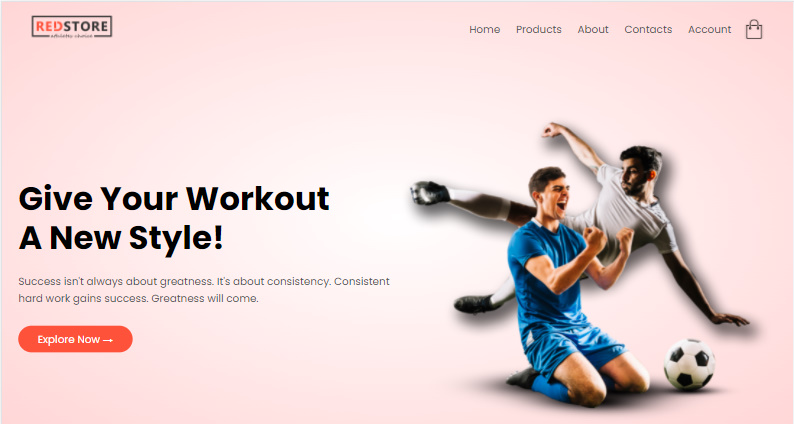
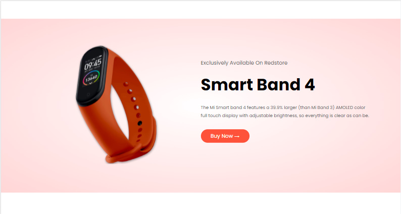
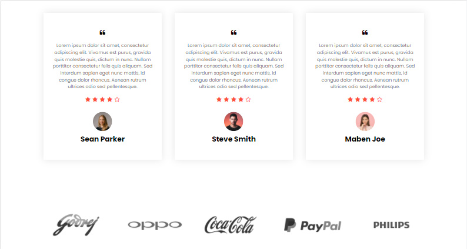
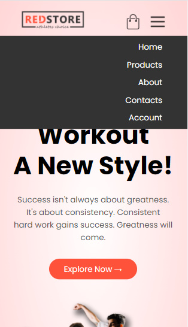
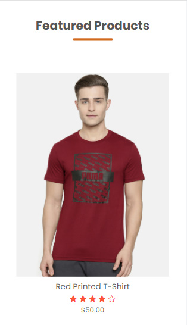
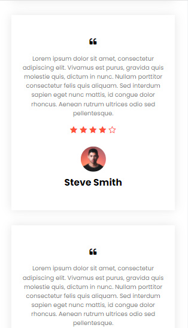

# Ecommerce Website - An ecommerce website landing page 

## Welcome! 👋

Thanks for checking out this page.

## Techstack Used

**HTML, CSS**

## Challenge Description

The challenge is to build out this landing page and get it look user friendly at possible screen sizes. It is a completely responsive website page.

Users are able to: 

- View the optimal layout for the site depending on their device's screen size
- See hover states for all interactive elements on the page

## Links
 📌 [Repository Link](https://github.com/ishika-rg/Ecommerce-website) 
 📌 [Live Link](https://ishika-rg.github.io/Ecommerce-website/)

    

## Output Images 

👉 Desktop Design

<table>
<tr>

<td></td>
<td></td>

</tr>

<tr>

<td></td>
<td></td>
</tr>

</table>

👉 Mobile Design

<table>
<tr>
<td>
</td>
<td>
</td>

</tr>
<tr>
<td>
</td>
<td>
</td>

</tr>

</table>

## Project Reference
This project is taken from You tube.  [Click here](https://www.youtube.com/watch?v=yQimoqo0-7g&t=2488s) 

